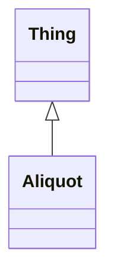

# Class: Aliquot
_An aliquot of a sample_


URI: [include:Aliquot](https://w3id.org/include/Aliquot)





## Inheritance
* [Thing](Thing.md)
    * **Aliquot**


## Slots

| Name | Cardinality and Range  | Description  |
| ---  | ---  | --- |


## Usages


| used by | used in | type | used |
| ---  | --- | --- | --- |
| [Biospecimen](Biospecimen.md) | [has_aliquot](has_aliquot.md) | range | Aliquot |


## Identifier and Mapping Information


### Annotations

| property | value |
| --- | --- |
| required | False |
| requires_component | Biospecimen |


### Schema Source


* from schema: https://w3id.org/include


## Mappings

| Mapping Type | Mapped Value |
| ---  | ---  |
| self | ['include:Aliquot'] |
| native | ['include:Aliquot'] |


## LinkML Specification

<!-- TODO: investigate https://stackoverflow.com/questions/37606292/how-to-create-tabbed-code-blocks-in-mkdocs-or-sphinx -->

### Direct

<details>
```yaml
name: Aliquot
definition_uri: include:Aliquot
annotations:
  required:
    tag: required
    value: 'False'
  requires_component:
    tag: requires_component
    value: Biospecimen
description: An aliquot of a sample
title: Aliquot
from_schema: https://w3id.org/include
rank: 1000
is_a: Thing

```
</details>

### Induced

<details>
```yaml
name: Aliquot
definition_uri: include:Aliquot
annotations:
  required:
    tag: required
    value: 'False'
  requires_component:
    tag: requires_component
    value: Biospecimen
description: An aliquot of a sample
title: Aliquot
from_schema: https://w3id.org/include
rank: 1000
is_a: Thing

```
</details>