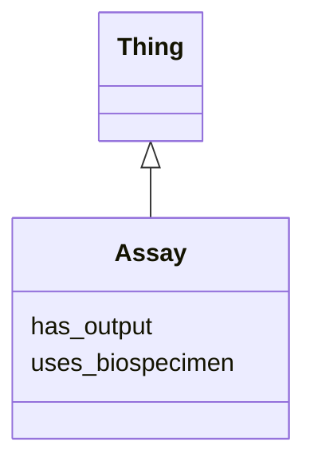

# Class: Assay
_An assay_


URI: [https://w3id.org/include/assay/:Assay](https://w3id.org/include/assay/:Assay)





## Inheritance
* [Thing](Thing.md)
    * **Assay**


## Slots

| Name | Cardinality and Range  | Description  |
| ---  | ---  | --- |
| [uses_biospecimen](uses_biospecimen.md) | 0..1 <br/> [Biospecimen](Biospecimen.md)  | The Biospecimen an Assay is performed on  |
| [has_output](has_output.md) | 0..1 <br/> [DataFile](DataFile.md)  | The DataFile Output of an Assay  |


## Usages


## Identifier and Mapping Information


### Annotations

| property | value |
| --- | --- |
| required | False |
| requires_component | Biospecimen,DataFile |


### Schema Source


* from schema: https://w3id.org/include/assay


## Mappings

| Mapping Type | Mapped Value |
| ---  | ---  |
| self | ['https://w3id.org/include/assay/:Assay'] |
| native | ['https://w3id.org/include/assay/:Assay'] |


## LinkML Specification

<!-- TODO: investigate https://stackoverflow.com/questions/37606292/how-to-create-tabbed-code-blocks-in-mkdocs-or-sphinx -->

### Direct

<details>
```yaml
name: Assay
definition_uri: include:Assay
annotations:
  required:
    tag: required
    value: 'False'
  requires_component:
    tag: requires_component
    value: Biospecimen,DataFile
description: An assay
title: Assay
from_schema: https://w3id.org/include/assay
rank: 1000
is_a: Thing
slots:
- uses_biospecimen
- has_output

```
</details>

### Induced

<details>
```yaml
name: Assay
definition_uri: include:Assay
annotations:
  required:
    tag: required
    value: 'False'
  requires_component:
    tag: requires_component
    value: Biospecimen,DataFile
description: An assay
title: Assay
from_schema: https://w3id.org/include/assay
rank: 1000
is_a: Thing
attributes:
  uses_biospecimen:
    name: uses_biospecimen
    definition_uri: include:uses_biospecimen
    description: The Biospecimen an Assay is performed on
    from_schema: https://w3id.org/include/assay
    rank: 1000
    alias: uses_biospecimen
    owner: Assay
    domain_of:
    - Assay
    - Assay
    range: Biospecimen
  has_output:
    name: has_output
    definition_uri: include:has_output
    description: The DataFile Output of an Assay
    from_schema: https://w3id.org/include/assay
    rank: 1000
    alias: has_output
    owner: Assay
    domain_of:
    - Assay
    - Assay
    range: DataFile

```
</details>