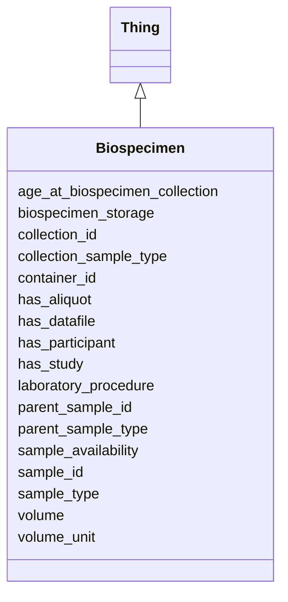

# Class: Biospecimen
_A Biospecimen Collected from A Participant_


URI: [include:Biospecimen](https://w3id.org/include/Biospecimen)





## Inheritance
* [Thing](Thing.md)
    * **Biospecimen**


## Slots

| Name | Cardinality and Range  | Description  |
| ---  | ---  | --- |
| [age_at_biospecimen_collection](age_at_biospecimen_collection.md) | 0..1 <br/> [xsd:string](xsd:string)  | Age in days of participant at time of biospecimen collection  |
| [biospecimen_storage](biospecimen_storage.md) | 0..1 <br/> [xsd:string](xsd:string)  | Method by which Container is stored (e  |
| [collection_id](collection_id.md) | 0..1 <br/> [xsd:string](xsd:string)  | Identifier for the eldest sample in a lineage of processed, pooled, or aliquo...  |
| [collection_sample_type](collection_sample_type.md) | 0..1 <br/> [xsd:string](xsd:string)  | Type of biological material comprising the collected sample (e  |
| [container_id](container_id.md) | 0..1 <br/> [xsd:string](xsd:string)  | Identifier for specific container/aliquot of sample, if applicable  |
| [has_datafile](has_datafile.md) | 0..1 <br/> [DataFile](DataFile.md)  | Link to a DataFile  |
| [has_participant](has_participant.md) | 0..1 <br/> [Participant](Participant.md)  | Link to a Participant  |
| [has_study](has_study.md) | 0..1 <br/> [Study](Study.md)  | Link to a Study  |
| [laboratory_procedure](laboratory_procedure.md) | 0..1 <br/> [xsd:string](xsd:string)  | Procedure by which Sample was derived from Parent Sample (e  |
| [parent_sample_id](parent_sample_id.md) | 0..1 <br/> [xsd:string](xsd:string)  | Identifier for the direct parent from which Sample was derived, processed, po...  |
| [parent_sample_type](parent_sample_type.md) | 0..1 <br/> [xsd:string](xsd:string)  | Type of biological material comprising the parent sample (e  |
| [sample_availability](sample_availability.md) | 0..1 <br/> [EnumSampleAvailability](EnumSampleAvailability.md)  | Whether or not the sample is potentially available for sharing through the Vi...  |
| [sample_id](sample_id.md) | 1..1 <br/> [xsd:string](xsd:string)  | Identifier for sample  |
| [sample_type](sample_type.md) | 1..1 <br/> [xsd:string](xsd:string)  | Type of biological material comprising the sample (e  |
| [volume](volume.md) | 0..1 <br/> [xsd:string](xsd:string)  | Amount of sample in container  |
| [volume_unit](volume_unit.md) | 0..1 <br/> [xsd:string](xsd:string)  | Unit of sample volume  |
| [has_aliquot](has_aliquot.md) | 0..1 <br/> [Aliquot](Aliquot.md)  | An aliquot of a sample  |


## Usages


| used by | used in | type | used |
| ---  | --- | --- | --- |
| [DataFile](DataFile.md) | [has_biospecimen](has_biospecimen.md) | range | Biospecimen |
| [Assay](Assay.md) | [uses_biospecimen](uses_biospecimen.md) | range | Biospecimen |


## Identifier and Mapping Information


### Annotations

| property | value |
| --- | --- |
| required | False |
| requires_component | Study,Participant,DataFile |


### Schema Source


* from schema: https://w3id.org/include


## Mappings

| Mapping Type | Mapped Value |
| ---  | ---  |
| self | ['include:Biospecimen'] |
| native | ['include:Biospecimen'] |


## LinkML Specification

<!-- TODO: investigate https://stackoverflow.com/questions/37606292/how-to-create-tabbed-code-blocks-in-mkdocs-or-sphinx -->

### Direct

<details>
```yaml
name: Biospecimen
definition_uri: include:Biospecimen
annotations:
  required:
    tag: required
    value: 'False'
  requires_component:
    tag: requires_component
    value: Study,Participant,DataFile
description: A Biospecimen Collected from A Participant
title: Biospecimen
from_schema: https://w3id.org/include
rank: 1000
is_a: Thing
slots:
- age_at_biospecimen_collection
- biospecimen_storage
- collection_id
- collection_sample_type
- container_id
- has_datafile
- has_participant
- has_study
- laboratory_procedure
- parent_sample_id
- parent_sample_type
- sample_availability
- sample_id
- sample_type
- volume
- volume_unit
- has_study
- has_aliquot

```
</details>

### Induced

<details>
```yaml
name: Biospecimen
definition_uri: include:Biospecimen
annotations:
  required:
    tag: required
    value: 'False'
  requires_component:
    tag: requires_component
    value: Study,Participant,DataFile
description: A Biospecimen Collected from A Participant
title: Biospecimen
from_schema: https://w3id.org/include
rank: 1000
is_a: Thing
attributes:
  age_at_biospecimen_collection:
    name: age_at_biospecimen_collection
    definition_uri: include:age_at_biospecimen_collection
    description: Age in days of participant at time of biospecimen collection
    from_schema: https://w3id.org/include
    rank: 1000
    alias: age_at_biospecimen_collection
    owner: Biospecimen
    domain_of:
    - Biospecimen
    - Biospecimen
    range: string
  biospecimen_storage:
    name: biospecimen_storage
    definition_uri: include:biospecimen_storage
    description: Method by which Container is stored (e.g. -80C freezer, Liquid nitrogen,
      etc.)
    from_schema: https://w3id.org/include
    rank: 1000
    alias: biospecimen_storage
    owner: Biospecimen
    domain_of:
    - Biospecimen
    - Biospecimen
    range: string
  collection_id:
    name: collection_id
    definition_uri: include:collection_id
    description: Identifier for the eldest sample in a lineage of processed, pooled,
      or aliquoted samples. This may be the same as Parent Sample ID or Sample ID
      (if no processing was performed).
    from_schema: https://w3id.org/include
    rank: 1000
    alias: collection_id
    owner: Biospecimen
    domain_of:
    - Biospecimen
    - DataFile
    - Biospecimen
    - DataFile
    range: string
  collection_sample_type:
    name: collection_sample_type
    definition_uri: include:collection_sample_type
    description: Type of biological material comprising the collected sample (e.g.
      Whole blood, Bone marrow, Saliva, etc.)
    from_schema: https://w3id.org/include
    rank: 1000
    alias: collection_sample_type
    owner: Biospecimen
    domain_of:
    - Biospecimen
    - Biospecimen
    range: string
  container_id:
    name: container_id
    definition_uri: include:container_id
    description: Identifier for specific container/aliquot of sample, if applicable.
      For example, distinct aliquots of a sample will have the same Sample ID but
      different Container IDs.
    from_schema: https://w3id.org/include
    rank: 1000
    alias: container_id
    owner: Biospecimen
    domain_of:
    - Biospecimen
    - Biospecimen
    range: string
  has_datafile:
    name: has_datafile
    definition_uri: include:has_datafile
    description: Link to a DataFile
    from_schema: https://w3id.org/include
    rank: 1000
    alias: has_datafile
    owner: Biospecimen
    domain_of:
    - Biospecimen
    - Participant
    - Biospecimen
    - Participant
    range: DataFile
  has_participant:
    name: has_participant
    definition_uri: include:has_participant
    description: Link to a Participant
    from_schema: https://w3id.org/include
    rank: 1000
    alias: has_participant
    owner: Biospecimen
    domain_of:
    - Biospecimen
    - DataFile
    - Biospecimen
    - DataFile
    - FamilyGroup
    range: Participant
  has_study:
    name: has_study
    definition_uri: include:has_study
    description: Link to a Study
    from_schema: https://w3id.org/include
    rank: 1000
    alias: has_study
    owner: Biospecimen
    domain_of:
    - Biospecimen
    - DataFile
    - Participant
    - Biospecimen
    - DataFile
    - Participant
    range: Study
  laboratory_procedure:
    name: laboratory_procedure
    definition_uri: include:laboratory_procedure
    description: Procedure by which Sample was derived from Parent Sample (e.g. RBC
      lysis, Centrifugation, Ficoll, etc.)
    from_schema: https://w3id.org/include
    rank: 1000
    alias: laboratory_procedure
    owner: Biospecimen
    domain_of:
    - Biospecimen
    - Biospecimen
    range: string
  parent_sample_id:
    name: parent_sample_id
    definition_uri: include:parent_sample_id
    description: Identifier for the direct parent from which Sample was derived, processed,
      pooled, etc. (if applicable)
    from_schema: https://w3id.org/include
    rank: 1000
    alias: parent_sample_id
    owner: Biospecimen
    domain_of:
    - Biospecimen
    - Biospecimen
    range: string
  parent_sample_type:
    name: parent_sample_type
    definition_uri: include:parent_sample_type
    description: Type of biological material comprising the parent sample (e.g. Plasma,
      Serum, White blood cells, etc.)
    from_schema: https://w3id.org/include
    rank: 1000
    alias: parent_sample_type
    owner: Biospecimen
    domain_of:
    - Biospecimen
    - Biospecimen
    range: string
  sample_availability:
    name: sample_availability
    definition_uri: include:sample_availability
    description: Whether or not the sample is potentially available for sharing through
      the Virtual Biorepository
    from_schema: https://w3id.org/include
    rank: 1000
    alias: sample_availability
    owner: Biospecimen
    domain_of:
    - Biospecimen
    - Biospecimen
    range: enum_sample_availability
  sample_id:
    name: sample_id
    definition_uri: include:sample_id
    description: Identifier for sample. A sample is a unique biological material;
      two samples with two different IDs are biologically distinct.
    from_schema: https://w3id.org/include
    rank: 1000
    alias: sample_id
    owner: Biospecimen
    domain_of:
    - Biospecimen
    - Biospecimen
    range: string
    required: true
  sample_type:
    name: sample_type
    definition_uri: include:sample_type
    description: Type of biological material comprising the sample (e.g. Plasma, Serum,
      White blood cells, DNA, RNA, etc.)
    from_schema: https://w3id.org/include
    rank: 1000
    alias: sample_type
    owner: Biospecimen
    domain_of:
    - Biospecimen
    - Biospecimen
    range: string
    required: true
  volume:
    name: volume
    definition_uri: include:volume
    description: Amount of sample in container
    from_schema: https://w3id.org/include
    rank: 1000
    alias: volume
    owner: Biospecimen
    domain_of:
    - Biospecimen
    - Biospecimen
    range: string
  volume_unit:
    name: volume_unit
    definition_uri: include:volume_unit
    description: Unit of sample volume
    from_schema: https://w3id.org/include
    rank: 1000
    alias: volume_unit
    owner: Biospecimen
    domain_of:
    - Biospecimen
    - Biospecimen
    range: string
  has_aliquot:
    name: has_aliquot
    definition_uri: include:has_aliquot
    description: An aliquot of a sample
    from_schema: https://w3id.org/include
    rank: 1000
    alias: has_aliquot
    owner: Biospecimen
    domain_of:
    - Biospecimen
    - Biospecimen
    range: Aliquot

```
</details>