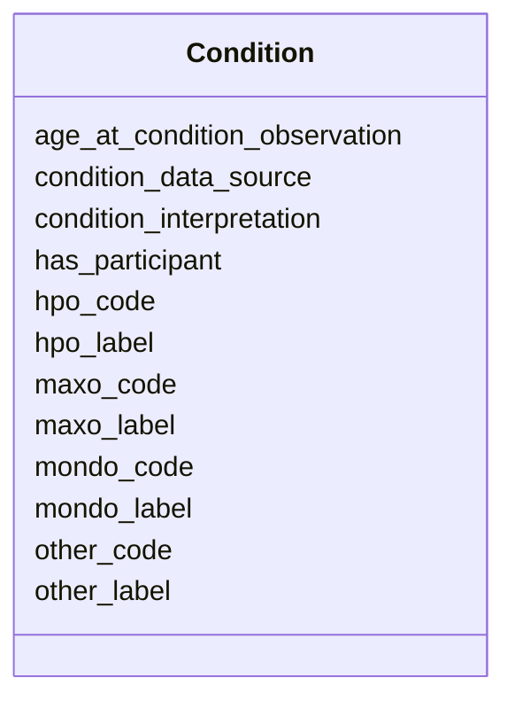

# Class: Condition


URI: [https://w3id.org/include/participant/:Condition](https://w3id.org/include/participant/:Condition)





<!-- no inheritance hierarchy -->


## Slots

| Name | Cardinality and Range  | Description  |
| ---  | ---  | --- |
| [has_participant](has_participant.md) | 0..1 <br/> [Participant](Participant.md)  | Link to a Participant  |
| [age_at_condition_observation](age_at_condition_observation.md) | 0..1 <br/> NONE  | Age in days at which condition was observed, recorded, or diagnosed  |
| [mondo_label](mondo_label.md) | 0..1 <br/> NONE  | Label for condition in the Mondo Disease Ontology (MONDO)  |
| [mondo_code](mondo_code.md) | 0..1 <br/> NONE  | Code for condition in the Mondo Disease Ontology (MONDO)  |
| [condition_interpretation](condition_interpretation.md) | 0..1 <br/> [EnumConditionInterpretation](EnumConditionInterpretation.md)  | Whether condition was observed or not  |
| [condition_data_source](condition_data_source.md) | 0..1 <br/> [EnumConditionDataSource](EnumConditionDataSource.md)  | Whether condition information was obtained from medical records (Clinical) or...  |
| [hpo_label](hpo_label.md) | 0..1 <br/> NONE  | Label for condition in the Human Phenotype Ontology (HPO)  |
| [hpo_code](hpo_code.md) | 0..1 <br/> NONE  | Code for condition in the Human Phenotype Ontology (HPO)  |
| [maxo_label](maxo_label.md) | 0..1 <br/> NONE  | Label for condition in the Medical Action Ontology (MAXO)  |
| [maxo_code](maxo_code.md) | 0..1 <br/> NONE  | Code for condition in the Medical Action Ontology (MAXO)  |
| [other_label](other_label.md) | 0..1 <br/> NONE  | Label for condition in another ontology (if no match in HPO, MONDO, or MAXO)  |
| [other_code](other_code.md) | 0..1 <br/> NONE  | Code for condition in another ontology (if no match in HPO, MONDO, or MAXO)  |


## Usages


## Identifier and Mapping Information


### Schema Source


* from schema: https://w3id.org/include/participant


## Mappings

| Mapping Type | Mapped Value |
| ---  | ---  |
| self | ['https://w3id.org/include/participant/:Condition'] |
| native | ['https://w3id.org/include/participant/:Condition'] |


## LinkML Specification

<!-- TODO: investigate https://stackoverflow.com/questions/37606292/how-to-create-tabbed-code-blocks-in-mkdocs-or-sphinx -->

### Direct

<details>
```yaml
name: Condition
from_schema: https://w3id.org/include/participant
rank: 1000
slots:
- has_participant
- age_at_condition_observation
- mondo_label
- mondo_code
- condition_interpretation
- condition_data_source
- hpo_label
- hpo_code
- maxo_label
- maxo_code
- other_label
- other_code

```
</details>

### Induced

<details>
```yaml
name: Condition
from_schema: https://w3id.org/include/participant
rank: 1000
attributes:
  has_participant:
    name: has_participant
    definition_uri: include:has_participant
    description: Link to a Participant
    title: Has Participant
    from_schema: https://w3id.org/include/participant
    rank: 1000
    alias: has_participant
    owner: Condition
    domain_of:
    - FamilyGroup
    - Condition
    - Biospecimen
    - DataFile
    range: Participant
  age_at_condition_observation:
    name: age_at_condition_observation
    definition_uri: include:age_at_condition_observation
    description: Age in days at which condition was observed, recorded, or diagnosed
    title: Age At Condition Observation
    from_schema: https://w3id.org/include/participant
    rank: 1000
    alias: age_at_condition_observation
    owner: Condition
    domain_of:
    - Condition
  mondo_label:
    name: mondo_label
    definition_uri: include:mondo_label
    description: Label for condition in the Mondo Disease Ontology (MONDO)
    title: Mondo Label
    from_schema: https://w3id.org/include/participant
    rank: 1000
    alias: mondo_label
    owner: Condition
    domain_of:
    - Condition
  mondo_code:
    name: mondo_code
    definition_uri: include:mondo_code
    description: Code for condition in the Mondo Disease Ontology (MONDO)
    title: Mondo Code
    from_schema: https://w3id.org/include/participant
    rank: 1000
    alias: mondo_code
    owner: Condition
    domain_of:
    - Condition
  condition_interpretation:
    name: condition_interpretation
    definition_uri: include:condition_interpretation
    description: Whether condition was observed or not. "Not Observed" indicates participant
      was specifically examined for that condition, or health record specifically
      queried for that condition, and found to be negative. Sept. 2022 release will
      only include positive assertions.
    title: Condition Interpretation
    from_schema: https://w3id.org/include/participant
    rank: 1000
    alias: condition_interpretation
    owner: Condition
    domain_of:
    - Condition
    range: enum_condition_interpretation
  condition_data_source:
    name: condition_data_source
    definition_uri: include:condition_data_source
    description: Whether condition information was obtained from medical records (Clinical)
      or patient survey (Self-Reported)
    title: Condition Data Source
    from_schema: https://w3id.org/include/participant
    rank: 1000
    alias: condition_data_source
    owner: Condition
    domain_of:
    - Condition
    range: enum_condition_data_source
  hpo_label:
    name: hpo_label
    definition_uri: include:hpo_label
    description: Label for condition in the Human Phenotype Ontology (HPO)
    title: Hpo Label
    from_schema: https://w3id.org/include/participant
    rank: 1000
    alias: hpo_label
    owner: Condition
    domain_of:
    - Condition
  hpo_code:
    name: hpo_code
    definition_uri: include:hpo_code
    description: Code for condition in the Human Phenotype Ontology (HPO)
    title: Hpo Code
    from_schema: https://w3id.org/include/participant
    rank: 1000
    alias: hpo_code
    owner: Condition
    domain_of:
    - Condition
  maxo_label:
    name: maxo_label
    definition_uri: include:maxo_label
    description: Label for condition in the Medical Action Ontology (MAXO)
    title: Maxo Label
    from_schema: https://w3id.org/include/participant
    rank: 1000
    alias: maxo_label
    owner: Condition
    domain_of:
    - Condition
  maxo_code:
    name: maxo_code
    definition_uri: include:maxo_code
    description: Code for condition in the Medical Action Ontology (MAXO)
    title: Maxo Code
    from_schema: https://w3id.org/include/participant
    rank: 1000
    alias: maxo_code
    owner: Condition
    domain_of:
    - Condition
  other_label:
    name: other_label
    definition_uri: include:other_label
    description: Label for condition in another ontology (if no match in HPO, MONDO,
      or MAXO)
    title: Other Label
    from_schema: https://w3id.org/include/participant
    rank: 1000
    alias: other_label
    owner: Condition
    domain_of:
    - Condition
  other_code:
    name: other_code
    definition_uri: include:other_code
    description: Code for condition in another ontology (if no match in HPO, MONDO,
      or MAXO)
    title: Other Code
    from_schema: https://w3id.org/include/participant
    rank: 1000
    alias: other_code
    owner: Condition
    domain_of:
    - Condition

```
</details>