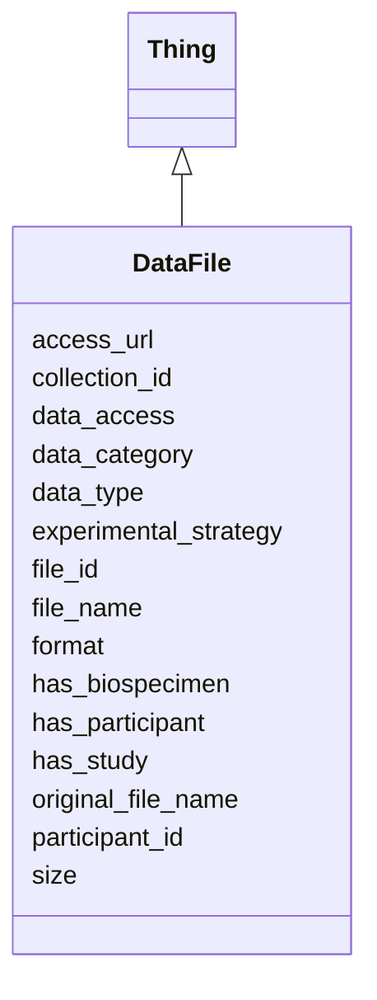

# Class: DataFile
_A DataFile Associated with a Participant or Study or Biospecimen_


URI: [https://w3id.org/include/assay/:DataFile](https://w3id.org/include/assay/:DataFile)





## Inheritance
* [Thing](Thing.md)
    * **DataFile**


## Slots

| Name | Cardinality and Range  | Description  |
| ---  | ---  | --- |
| [access_url](access_url.md) | 0..1 <br/> [xsd:anyURI](xsd:anyURI)  | Storage location for this file  |
| [collection_id](collection_id.md) | 0..1 <br/> NONE  | Identifier for the eldest sample in a lineage of processed, pooled, or aliquo...  |
| [data_access](data_access.md) | 0..1 <br/> [EnumDataAccess](EnumDataAccess.md)  | Type of access control on this file, determined by DCC  |
| [data_category](data_category.md) | 1..1 <br/> NONE  | General category of data in file (e  |
| [data_type](data_type.md) | 0..1 <br/> NONE  | Specific type of data contained in file (e  |
| [experimental_strategy](experimental_strategy.md) | 0..1 <br/> NONE  | Experimental method used to obtain data in file (e  |
| [file_id](file_id.md) | 0..1 <br/> NONE  | File identifier, assigned by DCC  |
| [file_name](file_name.md) | 1..1 <br/> NONE  | Synapse ID for file  |
| [format](format.md) | 1..1 <br/> NONE  | Format of file (e  |
| [has_biospecimen](has_biospecimen.md) | 0..1 <br/> [Biospecimen](Biospecimen.md)  | Link to a Biospecimen  |
| [has_participant](has_participant.md) | 0..1 <br/> [Participant](Participant.md)  | Link to a Participant  |
| [has_study](has_study.md) | 0..1 <br/> [Study](Study.md)  | Link to a Study  |
| [participant_id](participant_id.md) | 1..1 <br/> NONE  | Unique identifier for the participant, assigned by DCC  |
| [size](size.md) | 0..1 <br/> NONE  | Size of file  |
| [original_file_name](original_file_name.md) | 1..1 <br/> NONE  | Name of file, assigned by data contributor  |


## Usages


| used by | used in | type | used |
| ---  | --- | --- | --- |
| [Participant](Participant.md) | [has_datafile](has_datafile.md) | range | DataFile |
| [Assay](Assay.md) | [has_output](has_output.md) | range | DataFile |
| [Biospecimen](Biospecimen.md) | [has_datafile](has_datafile.md) | range | DataFile |


## Identifier and Mapping Information


### Annotations

| property | value |
| --- | --- |
| required | False |
| requires_component | Study,Participant,Biospecimen |


### Schema Source


* from schema: https://w3id.org/include/assay


## Mappings

| Mapping Type | Mapped Value |
| ---  | ---  |
| self | ['https://w3id.org/include/assay/:DataFile'] |
| native | ['https://w3id.org/include/assay/:DataFile'] |


## LinkML Specification

<!-- TODO: investigate https://stackoverflow.com/questions/37606292/how-to-create-tabbed-code-blocks-in-mkdocs-or-sphinx -->

### Direct

<details>
```yaml
name: DataFile
definition_uri: include:DataFile
annotations:
  required:
    tag: required
    value: 'False'
  requires_component:
    tag: requires_component
    value: Study,Participant,Biospecimen
description: A DataFile Associated with a Participant or Study or Biospecimen
title: DataFile
from_schema: https://w3id.org/include/assay
rank: 1000
is_a: Thing
slots:
- access_url
- collection_id
- data_access
- data_category
- data_type
- experimental_strategy
- file_id
- file_name
- format
- has_biospecimen
- has_participant
- has_study
- participant_id
- size
- original_file_name

```
</details>

### Induced

<details>
```yaml
name: DataFile
definition_uri: include:DataFile
annotations:
  required:
    tag: required
    value: 'False'
  requires_component:
    tag: requires_component
    value: Study,Participant,Biospecimen
description: A DataFile Associated with a Participant or Study or Biospecimen
title: DataFile
from_schema: https://w3id.org/include/assay
rank: 1000
is_a: Thing
attributes:
  access_url:
    name: access_url
    definition_uri: include:access_url
    description: Storage location for this file
    title: Access Url
    from_schema: https://w3id.org/include/assay
    rank: 1000
    alias: access_url
    owner: DataFile
    domain_of:
    - DataFile
    range: uriorcurie
  collection_id:
    name: collection_id
    definition_uri: include:collection_id
    description: Identifier for the eldest sample in a lineage of processed, pooled,
      or aliquoted samples. This may be the same as Parent Sample ID or Sample ID
      (if no processing was performed).
    title: Collection Id
    from_schema: https://w3id.org/include/assay
    rank: 1000
    alias: collection_id
    owner: DataFile
    domain_of:
    - Biospecimen
    - DataFile
  data_access:
    name: data_access
    definition_uri: include:data_access
    description: Type of access control on this file, determined by DCC
    title: Data Access
    from_schema: https://w3id.org/include/assay
    rank: 1000
    alias: data_access
    owner: DataFile
    domain_of:
    - DataFile
    range: enum_data_access
  data_category:
    name: data_category
    definition_uri: include:data_category
    description: General category of data in file (e.g. Clinical, Genomics, Proteomics,
      Metabolomics, Immune maps, Transcriptomics, etc.)
    title: Data Category
    from_schema: https://w3id.org/include/assay
    rank: 1000
    alias: data_category
    owner: DataFile
    domain_of:
    - DataFile
    required: true
  data_type:
    name: data_type
    definition_uri: include:data_type
    description: Specific type of data contained in file (e.g. Aligned reads, Unaligned
      reads, SNV, CNV, Gene fusions, Isoform expression, Gene expression quantification,
      Structural variations, Cytokine profiles, Operation reports, Pathology reports,
      Histology images, Clinical supplement, Protein expression quantification, etc.)
    title: Data Type
    from_schema: https://w3id.org/include/assay
    rank: 1000
    alias: data_type
    owner: DataFile
    domain_of:
    - DataFile
  experimental_strategy:
    name: experimental_strategy
    definition_uri: include:experimental_strategy
    description: Experimental method used to obtain data in file (e.g. WGS, RNAseq,
      WXS, SOMAscan, Mass spec proteomics, LCMS metabolomics, Multiplex immunoassay,
      Meso Scale Discovery, etc.)
    title: Experimental Strategy
    from_schema: https://w3id.org/include/assay
    rank: 1000
    alias: experimental_strategy
    owner: DataFile
    domain_of:
    - DataFile
  file_id:
    name: file_id
    definition_uri: include:file_id
    description: File identifier, assigned by DCC
    title: File Id
    from_schema: https://w3id.org/include/assay
    rank: 1000
    alias: file_id
    owner: DataFile
    domain_of:
    - DataFile
  file_name:
    name: file_name
    definition_uri: include:file_name
    description: Synapse ID for file
    title: File Name
    from_schema: https://w3id.org/include/assay
    rank: 1000
    alias: file_name
    owner: DataFile
    domain_of:
    - DataFile
    required: true
  format:
    name: format
    definition_uri: include:format
    description: Format of file (e.g. bam, cram, vcf, csv, html, png, fastq, pdf,
      dicom, etc.)
    title: Format
    from_schema: https://w3id.org/include/assay
    rank: 1000
    alias: format
    owner: DataFile
    domain_of:
    - DataFile
    required: true
  has_biospecimen:
    name: has_biospecimen
    definition_uri: include:has_biospecimen
    description: Link to a Biospecimen
    title: Has Biospecimen
    from_schema: https://w3id.org/include/assay
    rank: 1000
    alias: has_biospecimen
    owner: DataFile
    domain_of:
    - DataFile
    range: Biospecimen
  has_participant:
    name: has_participant
    definition_uri: include:has_participant
    description: Link to a Participant
    title: Has Participant
    from_schema: https://w3id.org/include/participant
    rank: 1000
    alias: has_participant
    owner: DataFile
    domain_of:
    - FamilyGroup
    - Condition
    - Biospecimen
    - DataFile
    range: Participant
  has_study:
    name: has_study
    definition_uri: include:has_study
    description: Link to a Study
    title: Has Study
    from_schema: https://w3id.org/include/participant
    rank: 1000
    alias: has_study
    owner: DataFile
    domain_of:
    - Participant
    - Biospecimen
    - DataFile
    range: Study
  participant_id:
    name: participant_id
    definition_uri: include:participant_id
    description: Unique identifier for the participant, assigned by DCC
    title: Participant Id
    from_schema: https://w3id.org/include/participant
    rank: 1000
    alias: participant_id
    owner: DataFile
    domain_of:
    - Participant
    - DataFile
    required: true
  size:
    name: size
    definition_uri: include:size
    description: Size of file
    title: Size
    from_schema: https://w3id.org/include/assay
    rank: 1000
    alias: size
    owner: DataFile
    domain_of:
    - DataFile
  original_file_name:
    name: original_file_name
    definition_uri: include:original_file_name
    description: Name of file, assigned by data contributor
    title: Original File Name
    from_schema: https://w3id.org/include/assay
    rank: 1000
    alias: original_file_name
    owner: DataFile
    domain_of:
    - DataFile
    required: true

```
</details>