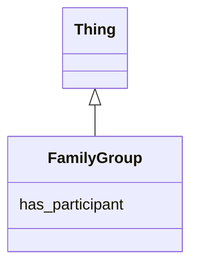

# Class: FamilyGroup
_A group of Participants in the same Study_


URI: [https://w3id.org/include/participant/:FamilyGroup](https://w3id.org/include/participant/:FamilyGroup)





## Inheritance
* [Thing](Thing.md)
    * **FamilyGroup**


## Slots

| Name | Cardinality and Range  | Description  |
| ---  | ---  | --- |
| [has_participant](has_participant.md) | 0..1 <br/> [Participant](Participant.md)  | Link to a Participant  |


## Usages


## Identifier and Mapping Information


### Annotations

| property | value |
| --- | --- |
| required | False |
| requires_component | Study,Participant |


### Schema Source


* from schema: https://w3id.org/include/participant


## Mappings

| Mapping Type | Mapped Value |
| ---  | ---  |
| self | ['https://w3id.org/include/participant/:FamilyGroup'] |
| native | ['https://w3id.org/include/participant/:FamilyGroup'] |


## LinkML Specification

<!-- TODO: investigate https://stackoverflow.com/questions/37606292/how-to-create-tabbed-code-blocks-in-mkdocs-or-sphinx -->

### Direct

<details>
```yaml
name: FamilyGroup
definition_uri: include:FamilyGroup
annotations:
  required:
    tag: required
    value: 'False'
  requires_component:
    tag: requires_component
    value: Study,Participant
description: A group of Participants in the same Study
title: FamilyGroup
from_schema: https://w3id.org/include/participant
rank: 1000
is_a: Thing
slots:
- has_participant

```
</details>

### Induced

<details>
```yaml
name: FamilyGroup
definition_uri: include:FamilyGroup
annotations:
  required:
    tag: required
    value: 'False'
  requires_component:
    tag: requires_component
    value: Study,Participant
description: A group of Participants in the same Study
title: FamilyGroup
from_schema: https://w3id.org/include/participant
rank: 1000
is_a: Thing
attributes:
  has_participant:
    name: has_participant
    definition_uri: include:has_participant
    description: Link to a Participant
    from_schema: https://w3id.org/include/participant
    rank: 1000
    alias: has_participant
    owner: FamilyGroup
    domain_of:
    - Biospecimen
    - DataFile
    - Condition
    - FamilyGroup
    - Condition
    - Biospecimen
    - DataFile
    range: Participant

```
</details>