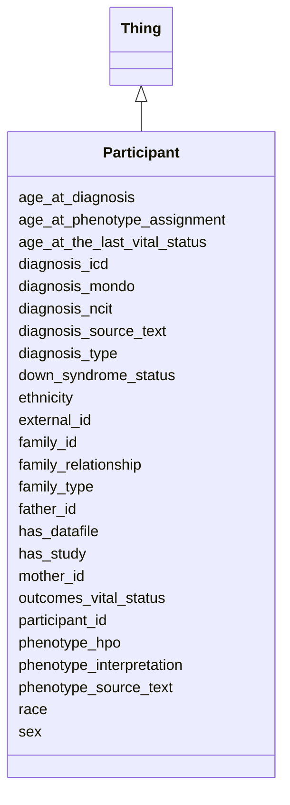

# Class: Participant
_A Participant in a Study_


URI: [include:Participant](https://w3id.org/include/Participant)





## Inheritance
* [Thing](Thing.md)
    * **Participant**


## Slots

| Name | Cardinality and Range  | Description  |
| ---  | ---  | --- |
| [age_at_diagnosis](age_at_diagnosis.md) | 0..1 <br/> [xsd:string](xsd:string)  | Age in days at which phenotype was assigned  |
| [age_at_phenotype_assignment](age_at_phenotype_assignment.md) | 0..1 <br/> [xsd:string](xsd:string)  | Age in days at which phenotype was recorded  |
| [age_at_the_last_vital_status](age_at_the_last_vital_status.md) | 0..1 <br/> [xsd:string](xsd:string)  | Age of last vital status  |
| [diagnosis_icd](diagnosis_icd.md) | 0..1 <br/> [xsd:string](xsd:string)  | ICD-10 code (annotated by data contributor or DCC)  |
| [diagnosis_mondo](diagnosis_mondo.md) | 0..1 <br/> [xsd:string](xsd:string)  | Mondo disease ontology code (annotated by data contributor or DCC)  |
| [diagnosis_ncit](diagnosis_ncit.md) | 0..1 <br/> [xsd:string](xsd:string)  | NCI Thesaurus code (annotated by data contributor or DCC)  |
| [diagnosis_source_text](diagnosis_source_text.md) | 0..1 <br/> [xsd:string](xsd:string)  | Diagnosis as described by data contributor  |
| [diagnosis_type](diagnosis_type.md) | 0..1 <br/> [xsd:string](xsd:string)  | How diagnosis was assigned  |
| [down_syndrome_status](down_syndrome_status.md) | 1..1 <br/> [EnumDownSyndromeStatus](EnumDownSyndromeStatus.md)  | Down Syndrome status of participant (T21 = Trisomy 21; D21 = Disomy 21, euplo...  |
| [ethnicity](ethnicity.md) | 1..1 <br/> [EnumEthnicity](EnumEthnicity.md)  | Ethnicity of participant  |
| [external_id](external_id.md) | 1..1 <br/> [xsd:string](xsd:string)  | Unique identifier for the participant, assigned by data contributor  |
| [family_id](family_id.md) | 0..1 <br/> [xsd:string](xsd:string)  | Unique identifer for family to which Participant belongs  |
| [family_relationship](family_relationship.md) | 0..1 <br/> [Participant](Participant.md)  | Relationship of Participant to other family members  |
| [family_type](family_type.md) | 1..1 <br/> [EnumFamilyType](EnumFamilyType.md)  | Structure of family members participating in the study (proband-only = no fam...  |
| [father_id](father_id.md) | 0..1 <br/> [xsd:string](xsd:string)  | Participant ID for Participant's father  |
| [has_datafile](has_datafile.md) | 0..1 <br/> [DataFile](DataFile.md)  | Link to a DataFile  |
| [has_study](has_study.md) | 0..1 <br/> [Study](Study.md)  | Link to a Study  |
| [mother_id](mother_id.md) | 0..1 <br/> [xsd:string](xsd:string)  | Participant ID for Participant's mother  |
| [outcomes_vital_status](outcomes_vital_status.md) | 0..1 <br/> [xsd:string](xsd:string)  | Whether participant is alive or dead  |
| [participant_id](participant_id.md) | 1..1 <br/> [xsd:string](xsd:string)  | Unique identifier for the participant, assigned by DCC  |
| [phenotype_hpo](phenotype_hpo.md) | 0..1 <br/> [xsd:string](xsd:string)  | Human Phenotype Ontology code (annotated by data contributor or DCC)  |
| [phenotype_source_text](phenotype_source_text.md) | 0..1 <br/> [xsd:string](xsd:string)  | Phenotype as described by data contributor  |
| [phenotype_interpretation](phenotype_interpretation.md) | 0..1 <br/> [EnumPhenotypeInterpretation](EnumPhenotypeInterpretation.md)  | Whether phenotype was observed or not  |
| [race](race.md) | 1..1 <br/> [EnumRace](EnumRace.md)  | Race of participant  |
| [sex](sex.md) | 1..1 <br/> [EnumSex](EnumSex.md)  | Sex of participant  |


## Usages


| used by | used in | type | used |
| ---  | --- | --- | --- |
| [Biospecimen](Biospecimen.md) | [has_participant](has_participant.md) | range | Participant |
| [DataFile](DataFile.md) | [has_participant](has_participant.md) | range | Participant |
| [Participant](Participant.md) | [family_relationship](family_relationship.md) | range | Participant |
| [FamilyGroup](FamilyGroup.md) | [has_participant](has_participant.md) | range | Participant |


## Identifier and Mapping Information


### Annotations

| property | value |
| --- | --- |
| required | False |
| requires_component | Study,DataFile |


### Schema Source


* from schema: https://w3id.org/include


## Mappings

| Mapping Type | Mapped Value |
| ---  | ---  |
| self | ['include:Participant'] |
| native | ['include:Participant'] |


## LinkML Specification

<!-- TODO: investigate https://stackoverflow.com/questions/37606292/how-to-create-tabbed-code-blocks-in-mkdocs-or-sphinx -->

### Direct

<details>
```yaml
name: Participant
definition_uri: include:Participant
annotations:
  required:
    tag: required
    value: 'False'
  requires_component:
    tag: requires_component
    value: Study,DataFile
description: A Participant in a Study
title: Participant
from_schema: https://w3id.org/include
rank: 1000
is_a: Thing
slots:
- age_at_diagnosis
- age_at_phenotype_assignment
- age_at_the_last_vital_status
- diagnosis_icd
- diagnosis_mondo
- diagnosis_ncit
- diagnosis_source_text
- diagnosis_type
- down_syndrome_status
- ethnicity
- external_id
- family_id
- family_relationship
- family_type
- father_id
- has_datafile
- has_study
- mother_id
- outcomes_vital_status
- participant_id
- phenotype_hpo
- phenotype_source_text
- phenotype_interpretation
- race
- sex

```
</details>

### Induced

<details>
```yaml
name: Participant
definition_uri: include:Participant
annotations:
  required:
    tag: required
    value: 'False'
  requires_component:
    tag: requires_component
    value: Study,DataFile
description: A Participant in a Study
title: Participant
from_schema: https://w3id.org/include
rank: 1000
is_a: Thing
attributes:
  age_at_diagnosis:
    name: age_at_diagnosis
    definition_uri: include:age_at_diagnosis
    description: Age in days at which phenotype was assigned
    from_schema: https://w3id.org/include
    rank: 1000
    alias: age_at_diagnosis
    owner: Participant
    domain_of:
    - Participant
    - Participant
    range: string
  age_at_phenotype_assignment:
    name: age_at_phenotype_assignment
    definition_uri: include:age_at_phenotype_assignment
    description: Age in days at which phenotype was recorded
    from_schema: https://w3id.org/include
    rank: 1000
    alias: age_at_phenotype_assignment
    owner: Participant
    domain_of:
    - Participant
    - Participant
    range: string
  age_at_the_last_vital_status:
    name: age_at_the_last_vital_status
    definition_uri: include:age_at_the_last_vital_status
    description: Age of last vital status
    from_schema: https://w3id.org/include
    rank: 1000
    alias: age_at_the_last_vital_status
    owner: Participant
    domain_of:
    - Participant
    - Participant
    range: string
  diagnosis_icd:
    name: diagnosis_icd
    definition_uri: include:diagnosis_icd
    description: ICD-10 code (annotated by data contributor or DCC)
    from_schema: https://w3id.org/include
    rank: 1000
    alias: diagnosis_icd
    owner: Participant
    domain_of:
    - Participant
    - Participant
    range: string
  diagnosis_mondo:
    name: diagnosis_mondo
    definition_uri: include:diagnosis_mondo
    description: Mondo disease ontology code (annotated by data contributor or DCC)
    from_schema: https://w3id.org/include
    rank: 1000
    alias: diagnosis_mondo
    owner: Participant
    domain_of:
    - Participant
    - Participant
    range: string
  diagnosis_ncit:
    name: diagnosis_ncit
    definition_uri: include:diagnosis_ncit
    description: NCI Thesaurus code (annotated by data contributor or DCC)
    from_schema: https://w3id.org/include
    rank: 1000
    alias: diagnosis_ncit
    owner: Participant
    domain_of:
    - Participant
    - Participant
    range: string
  diagnosis_source_text:
    name: diagnosis_source_text
    definition_uri: include:diagnosis_source_text
    description: Diagnosis as described by data contributor
    from_schema: https://w3id.org/include
    rank: 1000
    alias: diagnosis_source_text
    owner: Participant
    domain_of:
    - Participant
    - Participant
    range: string
  diagnosis_type:
    name: diagnosis_type
    definition_uri: include:diagnosis_type
    description: How diagnosis was assigned
    from_schema: https://w3id.org/include
    rank: 1000
    alias: diagnosis_type
    owner: Participant
    domain_of:
    - Participant
    - Participant
    range: string
  down_syndrome_status:
    name: down_syndrome_status
    definition_uri: include:down_syndrome_status
    description: Down Syndrome status of participant (T21 = Trisomy 21; D21 = Disomy
      21, euploid)
    from_schema: https://w3id.org/include
    rank: 1000
    alias: down_syndrome_status
    owner: Participant
    domain_of:
    - Participant
    - Participant
    range: enum_down_syndrome_status
    required: true
  ethnicity:
    name: ethnicity
    definition_uri: include:ethnicity
    description: Ethnicity of participant
    from_schema: https://w3id.org/include
    rank: 1000
    alias: ethnicity
    owner: Participant
    domain_of:
    - Participant
    - Participant
    range: enum_ethnicity
    required: true
  external_id:
    name: external_id
    definition_uri: include:external_id
    description: Unique identifier for the participant, assigned by data contributor
    from_schema: https://w3id.org/include
    rank: 1000
    alias: external_id
    owner: Participant
    domain_of:
    - Participant
    - Participant
    range: string
    required: true
  family_id:
    name: family_id
    definition_uri: include:family_id
    description: Unique identifer for family to which Participant belongs
    from_schema: https://w3id.org/include
    rank: 1000
    alias: family_id
    owner: Participant
    domain_of:
    - Participant
    - Participant
    range: string
  family_relationship:
    name: family_relationship
    definition_uri: include:family_relationship
    description: Relationship of Participant to other family members
    from_schema: https://w3id.org/include
    rank: 1000
    alias: family_relationship
    owner: Participant
    domain_of:
    - Participant
    - Participant
    range: Participant
  family_type:
    name: family_type
    definition_uri: include:family_type
    description: Structure of family members participating in the study (proband-only
      = no family members participating; duo = proband + parent; trio = proband +
      2 parents; trio+ = proband + 2 parents + other relatives)
    from_schema: https://w3id.org/include
    rank: 1000
    alias: family_type
    owner: Participant
    domain_of:
    - Participant
    - Participant
    range: enum_family_type
    required: true
  father_id:
    name: father_id
    definition_uri: include:father_id
    description: Participant ID for Participant's father
    from_schema: https://w3id.org/include
    rank: 1000
    alias: father_id
    owner: Participant
    domain_of:
    - Participant
    - Participant
    range: string
  has_datafile:
    name: has_datafile
    definition_uri: include:has_datafile
    description: Link to a DataFile
    from_schema: https://w3id.org/include
    rank: 1000
    alias: has_datafile
    owner: Participant
    domain_of:
    - Biospecimen
    - Participant
    - Biospecimen
    - Participant
    range: DataFile
  has_study:
    name: has_study
    definition_uri: include:has_study
    description: Link to a Study
    from_schema: https://w3id.org/include
    rank: 1000
    alias: has_study
    owner: Participant
    domain_of:
    - Biospecimen
    - DataFile
    - Participant
    - Biospecimen
    - DataFile
    - Participant
    range: Study
  mother_id:
    name: mother_id
    definition_uri: include:mother_id
    description: Participant ID for Participant's mother
    from_schema: https://w3id.org/include
    rank: 1000
    alias: mother_id
    owner: Participant
    domain_of:
    - Participant
    - Participant
    range: string
  outcomes_vital_status:
    name: outcomes_vital_status
    definition_uri: include:outcomes_vital_status
    description: Whether participant is alive or dead
    from_schema: https://w3id.org/include
    rank: 1000
    alias: outcomes_vital_status
    owner: Participant
    domain_of:
    - Participant
    - Participant
    range: string
  participant_id:
    name: participant_id
    definition_uri: include:participant_id
    description: Unique identifier for the participant, assigned by DCC
    from_schema: https://w3id.org/include
    rank: 1000
    alias: participant_id
    owner: Participant
    domain_of:
    - DataFile
    - Participant
    - DataFile
    - Participant
    range: string
    required: true
  phenotype_hpo:
    name: phenotype_hpo
    definition_uri: include:phenotype_hpo
    description: Human Phenotype Ontology code (annotated by data contributor or DCC)
    from_schema: https://w3id.org/include
    rank: 1000
    alias: phenotype_hpo
    owner: Participant
    domain_of:
    - Participant
    - Participant
    range: string
  phenotype_source_text:
    name: phenotype_source_text
    definition_uri: include:phenotype_source_text
    description: Phenotype as described by data contributor
    from_schema: https://w3id.org/include
    rank: 1000
    alias: phenotype_source_text
    owner: Participant
    domain_of:
    - Participant
    - Participant
    range: string
  phenotype_interpretation:
    name: phenotype_interpretation
    definition_uri: include:phenotype_interpretation
    description: Whether phenotype was observed or not
    from_schema: https://w3id.org/include
    rank: 1000
    alias: phenotype_interpretation
    owner: Participant
    domain_of:
    - Participant
    - Participant
    range: enum_phenotype_interpretation
  race:
    name: race
    definition_uri: include:race
    description: Race of participant
    from_schema: https://w3id.org/include
    rank: 1000
    alias: race
    owner: Participant
    domain_of:
    - Participant
    - Participant
    range: enum_race
    required: true
  sex:
    name: sex
    definition_uri: include:sex
    description: Sex of participant
    from_schema: https://w3id.org/include
    rank: 1000
    alias: sex
    owner: Participant
    domain_of:
    - Participant
    - Participant
    range: enum_sex
    required: true

```
</details>