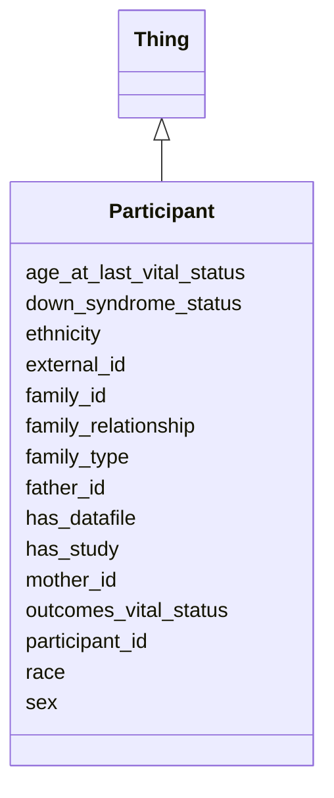

# Class: Participant
_A Participant in a Study_


URI: [https://w3id.org/include/participant/:Participant](https://w3id.org/include/participant/:Participant)





## Inheritance
* [Thing](Thing.md)
    * **Participant**


## Slots

| Name | Cardinality and Range  | Description  |
| ---  | ---  | --- |
| [age_at_last_vital_status](age_at_last_vital_status.md) | 0..1 <br/> NONE  | Age in days when participant's vital status was last recorded  |
| [down_syndrome_status](down_syndrome_status.md) | 1..1 <br/> [EnumDownSyndromeStatus](EnumDownSyndromeStatus.md)  | Down Syndrome status of participant (T21 = Trisomy 21; D21 = Disomy 21, euplo...  |
| [ethnicity](ethnicity.md) | 1..1 <br/> [EnumEthnicity](EnumEthnicity.md)  | Ethnicity of participant  |
| [external_id](external_id.md) | 1..1 <br/> NONE  | Unique identifier for the participant, assigned by data contributor  |
| [family_id](family_id.md) | 0..1 <br/> NONE  | Unique identifer for family to which Participant belongs  |
| [family_relationship](family_relationship.md) | 0..1 <br/> [Participant](Participant.md)  | Relationship of Participant to other family members  |
| [family_type](family_type.md) | 1..1 <br/> [EnumFamilyType](EnumFamilyType.md)  | Structure of family members participating in the study (proband-only = no fam...  |
| [father_id](father_id.md) | 0..1 <br/> NONE  | Participant ID for Participant's father  |
| [has_datafile](has_datafile.md) | 0..1 <br/> [DataFile](DataFile.md)  | Link to a DataFile  |
| [has_study](has_study.md) | 0..1 <br/> [Study](Study.md)  | Link to a Study  |
| [mother_id](mother_id.md) | 0..1 <br/> NONE  | Participant ID for Participant's mother  |
| [outcomes_vital_status](outcomes_vital_status.md) | 0..1 <br/> NONE  | Whether participant is alive or dead  |
| [participant_id](participant_id.md) | 1..1 <br/> NONE  | Unique identifier for the participant, assigned by DCC  |
| [race](race.md) | 1..1 <br/> [EnumRace](EnumRace.md)  | Race of participant  |
| [sex](sex.md) | 1..1 <br/> [EnumSex](EnumSex.md)  | Sex of participant  |


## Usages


| used by | used in | type | used |
| ---  | --- | --- | --- |
| [Participant](Participant.md) | [family_relationship](family_relationship.md) | range | Participant |
| [FamilyGroup](FamilyGroup.md) | [has_participant](has_participant.md) | range | Participant |
| [Condition](Condition.md) | [has_participant](has_participant.md) | range | Participant |
| [Biospecimen](Biospecimen.md) | [has_participant](has_participant.md) | range | Participant |
| [DataFile](DataFile.md) | [has_participant](has_participant.md) | range | Participant |


## Identifier and Mapping Information


### Annotations

| property | value |
| --- | --- |
| required | False |
| requires_component | Study,DataFile |


### Schema Source


* from schema: https://w3id.org/include/participant


## Mappings

| Mapping Type | Mapped Value |
| ---  | ---  |
| self | ['https://w3id.org/include/participant/:Participant'] |
| native | ['https://w3id.org/include/participant/:Participant'] |


## LinkML Specification

<!-- TODO: investigate https://stackoverflow.com/questions/37606292/how-to-create-tabbed-code-blocks-in-mkdocs-or-sphinx -->

### Direct

<details>
```yaml
name: Participant
definition_uri: include:Participant
annotations:
  required:
    tag: required
    value: 'False'
  requires_component:
    tag: requires_component
    value: Study,DataFile
description: A Participant in a Study
title: Participant
from_schema: https://w3id.org/include/participant
rank: 1000
is_a: Thing
slots:
- age_at_last_vital_status
- down_syndrome_status
- ethnicity
- external_id
- family_id
- family_relationship
- family_type
- father_id
- has_datafile
- has_study
- mother_id
- outcomes_vital_status
- participant_id
- race
- sex

```
</details>

### Induced

<details>
```yaml
name: Participant
definition_uri: include:Participant
annotations:
  required:
    tag: required
    value: 'False'
  requires_component:
    tag: requires_component
    value: Study,DataFile
description: A Participant in a Study
title: Participant
from_schema: https://w3id.org/include/participant
rank: 1000
is_a: Thing
attributes:
  age_at_last_vital_status:
    name: age_at_last_vital_status
    definition_uri: include:age_at_last_vital_status
    description: Age in days when participant's vital status was last recorded
    title: Age At Last Vital Status
    from_schema: https://w3id.org/include/participant
    rank: 1000
    alias: age_at_last_vital_status
    owner: Participant
    domain_of:
    - Participant
  down_syndrome_status:
    name: down_syndrome_status
    definition_uri: include:down_syndrome_status
    description: Down Syndrome status of participant (T21 = Trisomy 21; D21 = Disomy
      21, euploid)
    title: Down Syndrome Status
    from_schema: https://w3id.org/include/participant
    rank: 1000
    alias: down_syndrome_status
    owner: Participant
    domain_of:
    - Participant
    range: enum_down_syndrome_status
    required: true
  ethnicity:
    name: ethnicity
    definition_uri: include:ethnicity
    description: Ethnicity of participant
    title: Ethnicity
    from_schema: https://w3id.org/include/participant
    rank: 1000
    alias: ethnicity
    owner: Participant
    domain_of:
    - Participant
    range: enum_ethnicity
    required: true
  external_id:
    name: external_id
    definition_uri: include:external_id
    description: Unique identifier for the participant, assigned by data contributor
    title: External Id
    from_schema: https://w3id.org/include/participant
    rank: 1000
    alias: external_id
    owner: Participant
    domain_of:
    - Participant
    required: true
  family_id:
    name: family_id
    definition_uri: include:family_id
    description: Unique identifer for family to which Participant belongs
    title: Family Id
    from_schema: https://w3id.org/include/participant
    rank: 1000
    alias: family_id
    owner: Participant
    domain_of:
    - Participant
  family_relationship:
    name: family_relationship
    definition_uri: include:family_relationship
    description: Relationship of Participant to other family members
    title: Family Relationship
    from_schema: https://w3id.org/include/participant
    rank: 1000
    alias: family_relationship
    owner: Participant
    domain_of:
    - Participant
    range: Participant
  family_type:
    name: family_type
    definition_uri: include:family_type
    description: Structure of family members participating in the study (proband-only
      = no family members participating; duo = proband + parent; trio = proband +
      2 parents; trio+ = proband + 2 parents + other relatives)
    title: Family Type
    from_schema: https://w3id.org/include/participant
    rank: 1000
    alias: family_type
    owner: Participant
    domain_of:
    - Participant
    range: enum_family_type
    required: true
  father_id:
    name: father_id
    definition_uri: include:father_id
    description: Participant ID for Participant's father
    title: Father Id
    from_schema: https://w3id.org/include/participant
    rank: 1000
    alias: father_id
    owner: Participant
    domain_of:
    - Participant
  has_datafile:
    name: has_datafile
    definition_uri: include:has_datafile
    description: Link to a DataFile
    title: Has Datafile
    from_schema: https://w3id.org/include/assay
    rank: 1000
    alias: has_datafile
    owner: Participant
    domain_of:
    - Participant
    - Biospecimen
    range: DataFile
  has_study:
    name: has_study
    definition_uri: include:has_study
    description: Link to a Study
    title: Has Study
    from_schema: https://w3id.org/include/participant
    rank: 1000
    alias: has_study
    owner: Participant
    domain_of:
    - Participant
    - Biospecimen
    - DataFile
    range: Study
  mother_id:
    name: mother_id
    definition_uri: include:mother_id
    description: Participant ID for Participant's mother
    title: Mother Id
    from_schema: https://w3id.org/include/participant
    rank: 1000
    alias: mother_id
    owner: Participant
    domain_of:
    - Participant
  outcomes_vital_status:
    name: outcomes_vital_status
    definition_uri: include:outcomes_vital_status
    description: Whether participant is alive or dead
    title: Outcomes Vital Status
    from_schema: https://w3id.org/include/participant
    rank: 1000
    alias: outcomes_vital_status
    owner: Participant
    domain_of:
    - Participant
  participant_id:
    name: participant_id
    definition_uri: include:participant_id
    description: Unique identifier for the participant, assigned by DCC
    title: Participant Id
    from_schema: https://w3id.org/include/participant
    rank: 1000
    alias: participant_id
    owner: Participant
    domain_of:
    - Participant
    - DataFile
    required: true
  race:
    name: race
    definition_uri: include:race
    description: Race of participant
    title: Race
    from_schema: https://w3id.org/include/participant
    rank: 1000
    alias: race
    owner: Participant
    domain_of:
    - Participant
    range: enum_race
    required: true
  sex:
    name: sex
    definition_uri: include:sex
    description: Sex of participant
    title: Sex
    from_schema: https://w3id.org/include/participant
    rank: 1000
    alias: sex
    owner: Participant
    domain_of:
    - Participant
    range: enum_sex
    required: true

```
</details>