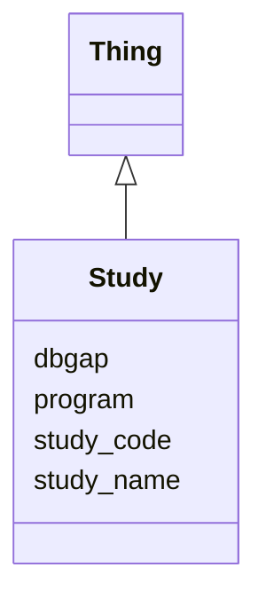

# Class: Study
_A Study_


URI: [https://w3id.org/include/study/:Study](https://w3id.org/include/study/:Study)





## Inheritance
* [Thing](Thing.md)
    * **Study**


## Slots

| Name | Cardinality and Range  | Description  |
| ---  | ---  | --- |
| [dbgap](dbgap.md) | 0..1 <br/> NONE  | dbGaP study accession code  |
| [program](program.md) | 1..1 <br/> [EnumProgram](EnumProgram.md)  | Funding source for the study  |
| [study_code](study_code.md) | 1..1 <br/> [EnumStudyCode](EnumStudyCode.md)  | Unique identifer for the study, assigned by DCC  |
| [study_name](study_name.md) | 1..1 <br/> NONE  | Name of the study, chosen by data contributor  |


## Usages


| used by | used in | type | used |
| ---  | --- | --- | --- |
| [Participant](Participant.md) | [has_study](has_study.md) | range | Study |
| [Biospecimen](Biospecimen.md) | [has_study](has_study.md) | range | Study |
| [DataFile](DataFile.md) | [has_study](has_study.md) | range | Study |


## Identifier and Mapping Information


### Annotations

| property | value |
| --- | --- |
| required | True |


### Schema Source


* from schema: https://w3id.org/include/study


## Mappings

| Mapping Type | Mapped Value |
| ---  | ---  |
| self | ['https://w3id.org/include/study/:Study'] |
| native | ['https://w3id.org/include/study/:Study'] |


## LinkML Specification

<!-- TODO: investigate https://stackoverflow.com/questions/37606292/how-to-create-tabbed-code-blocks-in-mkdocs-or-sphinx -->

### Direct

<details>
```yaml
name: Study
definition_uri: include:Study
annotations:
  required:
    tag: required
    value: 'True'
description: A Study
title: Study
from_schema: https://w3id.org/include/study
rank: 1000
is_a: Thing
slots:
- dbgap
- program
- study_code
- study_name

```
</details>

### Induced

<details>
```yaml
name: Study
definition_uri: include:Study
annotations:
  required:
    tag: required
    value: 'True'
description: A Study
title: Study
from_schema: https://w3id.org/include/study
rank: 1000
is_a: Thing
attributes:
  dbgap:
    name: dbgap
    definition_uri: include:dbgap
    description: dbGaP study accession code
    from_schema: https://w3id.org/include/study
    rank: 1000
    alias: dbgap
    owner: Study
    domain_of:
    - Study
    - Study
  program:
    name: program
    definition_uri: include:program
    description: Funding source for the study
    from_schema: https://w3id.org/include/study
    rank: 1000
    alias: program
    owner: Study
    domain_of:
    - Study
    - Study
    range: enum_program
    required: true
  study_code:
    name: study_code
    definition_uri: include:study_code
    description: Unique identifer for the study, assigned by DCC
    from_schema: https://w3id.org/include/study
    rank: 1000
    alias: study_code
    owner: Study
    domain_of:
    - Study
    - Study
    range: enum_study_code
    required: true
  study_name:
    name: study_name
    definition_uri: include:study_name
    description: Name of the study, chosen by data contributor
    from_schema: https://w3id.org/include/study
    rank: 1000
    alias: study_name
    owner: Study
    domain_of:
    - Study
    - Study
    required: true

```
</details>