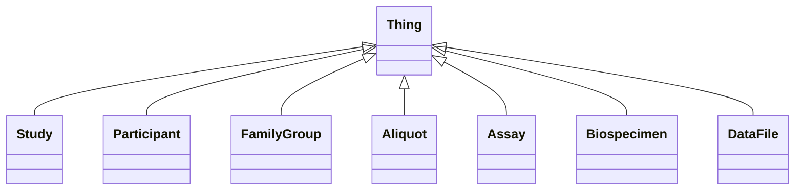

# Class: Thing
_Highest Level Class_


URI: [https://w3id.org/include/core/:Thing](https://w3id.org/include/core/:Thing)





## Inheritance
* **Thing**
    * [Study](Study.md)
    * [Participant](Participant.md)
    * [FamilyGroup](FamilyGroup.md)
    * [Aliquot](Aliquot.md)
    * [Assay](Assay.md)
    * [Biospecimen](Biospecimen.md)
    * [DataFile](DataFile.md)


## Slots

| Name | Cardinality and Range  | Description  |
| ---  | ---  | --- |


## Usages


## Identifier and Mapping Information


### Schema Source


* from schema: https://w3id.org/include/core


## Mappings

| Mapping Type | Mapped Value |
| ---  | ---  |
| self | ['https://w3id.org/include/core/:Thing'] |
| native | ['https://w3id.org/include/core/:Thing'] |


## LinkML Specification

<!-- TODO: investigate https://stackoverflow.com/questions/37606292/how-to-create-tabbed-code-blocks-in-mkdocs-or-sphinx -->

### Direct

<details>
```yaml
name: Thing
definition_uri: schema:Thing
description: Highest Level Class
title: Thing
from_schema: https://w3id.org/include/core
rank: 1000

```
</details>

### Induced

<details>
```yaml
name: Thing
definition_uri: schema:Thing
description: Highest Level Class
title: Thing
from_schema: https://w3id.org/include/core
rank: 1000

```
</details>